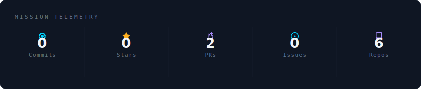

<!-- Albano Nebula — GitHub Profile -->

  

 

  

 

  

 

  

 

<strong>More about me</strong>

 

I design scalable backend systems using Go and cloud-native architectures.  
Focused on distributed systems, search platforms, event-driven architectures, and security-first engineering.

Experienced with AWS (EKS, Lambda, SQS, S3, EC2), Kubernetes, Airflow pipelines, CI/CD automation, and Elasticsearch/OpenSearch.

**Currently at** Noalab — Florianópolis, Brazil

 

  
  
  

